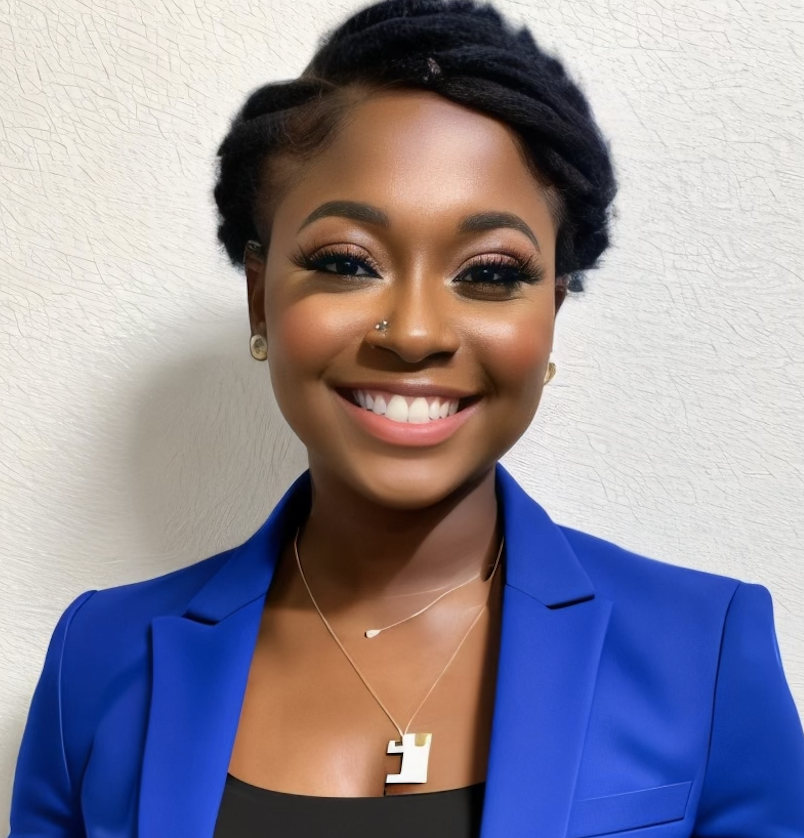

# **Denise A Tetteh**

## **About Me**
An ambitious and dedicated software engineering student at HyperionDev with a passion for creating innovative solutions. Possessing a diverse skill set including Python programming, logo designing, and adept problem-solving abilities, I thrive in collaborative environments where I can contribute to team success. With a background in education and healthcare, I bring strong communication skills, adaptability, and a commitment to excellence to every project.
## Skills
* Creation and implementation of new ideas  
* Multi-tasking and time management
* Cooperative team player
* Logo designing
* Written and oral communication
* Presentations
* Fast learner
* Adobe Photoshop proficiency
* Problem identification and resolution
* Python programming
* Git/GitHub
## **Contact Me**
* Email: denisetettehofficial@gmail.com
* LinkedIn: 
